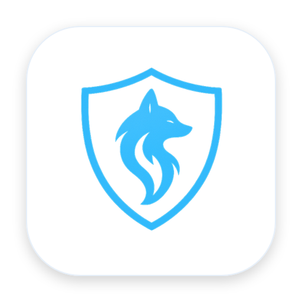

<p align="center">
  
</p>

<h1 align="center">Patronus Security</h1>

<p align="center">
  Local-first runtime protection and security scans for AI agents.
</p>

Patronus Security combines the Patronus Security CLI (the `patronus-security-scanner` executable) with optional Runtime Protection integrations for Codex, Claude Code and DeepSeek Harness. Patronus Ark powers detection. The integrations inspect external text before it reaches the model; completed findings keep dangerous content behind a verifiable receipt.

## Plugins

<table>
  <tr>
    <td align="center" width="33%">
      <a href="plugins/codex/README.md"><br><strong>Codex</strong></a>
    </td>
    <td align="center" width="33%">
      <a href="plugins/claude/README.md"><br><strong>Claude Code</strong></a>
    </td>
    <td align="center" width="33%">
      <a href="plugins/deepseek/README.md"><br><strong>DeepSeek Harness</strong></a>
    </td>
  </tr>
  <tr>
    <td>Native prompt, tool-result and MCP-result hooks.</td>
    <td>Native lifecycle, prompt and result hooks.</td>
    <td>Native Cordis request and response gates.</td>
  </tr>
</table>

Choose the hosts you use during onboarding. Each plugin page explains its hooks, protected flow and degraded behavior.

Patronus Security is an independent project and is not endorsed by OpenAI,
Anthropic or DeepSeek. Third-party names and logos identify compatibility only;
see [Third-party notices](THIRD_PARTY_NOTICES.md).

## Install

Install the latest release on macOS or Linux:

```sh
curl -fsSL https://github.com/patronus-protect/patronus-security-cli/releases/latest/download/install.sh | sh
```

The installer detects the platform, verifies the matching CLI artifact, installs
`patronus-security-scanner` to `~/.local/bin`, and opens onboarding. It does not
require an account for local protection.

To install the first release explicitly:

```sh
curl -fsSL https://github.com/patronus-protect/patronus-security-cli/releases/download/v0.1.0/install.sh | sh
```

Release checksums are available on the [GitHub Releases](https://github.com/patronus-protect/patronus-security-cli/releases) page for manual verification.

For a checksum-first installation and explicit coding-agent boundaries, follow
the [CLI installation runbook](INSTALL.md).

## API clients

Applications can submit scans directly with the small, contract-tested
[Rust, TypeScript and Python API clients](sdk/README.md). Each client README
includes registry installation, a quick start and error behavior. Each client
directory also contains a dedicated `INSTALL.md` that a coding agent can follow
without receiving your API key.

## Onboarding

Onboarding guides you through a short setup:

1. Sign in when you want cloud-backed features. Local protection works without an account.
2. Choose Local, Hybrid or API processing.
3. Patronus uses L3 analysis. For Local mode it measures a 256-token L3 check and recommends Hybrid when that takes more than 200 ms.
4. Run a visible injection check in the final processing mode.
5. Choose Full protection, Scanner + skills without automatic hooks, or CLI only. For either agent integration, select the detected hosts you use.

Run onboarding again at any time:

```sh
patronus-security-scanner onboarding
```

Run `patronus-security-scanner` without arguments in an interactive terminal to
open quick actions for scans, setup status, the dashboard and onboarding.
Arrow keys and Enter select an action; number keys select one directly. In
non-interactive use, the same command prints CLI help. Choosing onboarding keeps
the setup steps and their output in the terminal.

If you install another host later, either rerun onboarding or use one direct command:

```sh
patronus-security-scanner integration codex install
patronus-security-scanner integration claude install
patronus-security-scanner integration deepseek install
```

## Try it in a chat

Start a new agent chat after onboarding, then ask naturally:

> Check this repository with Patronus.

> Check this file with Patronus: `README.md`

> Check this URL with Patronus: `https://example.org`

> Patronus status.

Runtime protection is automatic. In a supported chat, `patronus on`, `patronus off`, and `patronus status` control or explain protection for that chat.

## Dashboard

Open the local dashboard to review activity, finish setup and adjust protection:

```sh
patronus-security-scanner dashboard
```

The dashboard runs on loopback and stores reports and settings on this device by default.

## Account

An account is optional for local checks, anonymous public URL scans, and explicit anonymous document uploads. Sign in for account usage, authenticated API processing, higher allowances, and MCP-server scans:

```sh
patronus-security-scanner auth login
patronus-security-scanner auth status
patronus-security-scanner auth logout
```

The browser provides a one-time code; do not paste API tokens into an agent chat.

## Reset or uninstall

Rerun `patronus-security-scanner onboarding` to reset setup choices without losing reports. To remove the CLI and all registered plugins:

```sh
patronus-security-scanner maintenance uninstall --all --yes
```

Saved settings, reports and credentials are preserved. Use `patronus-security-scanner auth logout` separately when you also want to disconnect the account.

## What Patronus covers

Patronus checks supported text for prompt injection, sensitive data and configured Ark classifications. Plugin protection covers user-prompt text, tool-result text and MCP text blocks. It does not scan tool requests, paths, metadata or media bytes.

MCP appears in three distinct places: the Patronus tools expose explicit scans, pending-result checks and redacted reads; runtime integrations protect text returned by foreign MCP servers; and an explicit audit of a public MCP server is a remote scan. Public URLs use the rate-limited anonymous API when no account credential is available. MCP-server audits remain authenticated. File, directory and repository scans extract UTF-8/UTF-16 text plus text from PDF and DOCX files on-device. In hybrid mode, every chunk from a file above 1024 tokens is analyzed through the API. Add `--anonymous-api` only when you explicitly want to upload one complete TXT, Markdown, HTML, PDF, or DOCX document.

Patronus is not a general SAST, dependency, CVE, malware or runtime-behaviour scanner. A clean result is useful evidence, not proof that arbitrary software is safe.

For exact behavior, see [configuration](docs/configuration.md), [privacy](docs/privacy.md), the [runtime text contract](docs/runtime-text-contract.md), and the [threat model](docs/threat-model.md).

## License

The Patronus Security CLI and its first-party integrations are the Apache-2.0-licensed community project. The CLI depends on the separately licensed first-party `patronus-ark` engine, which remains GPL-3.0-only and is explicitly approved by the repository's package-scoped license policy. Third-party components and model assets retain their own terms; see [licensing notes](docs/licensing.md), [`deny.toml`](deny.toml), and `THIRD_PARTY_NOTICES.md`.
